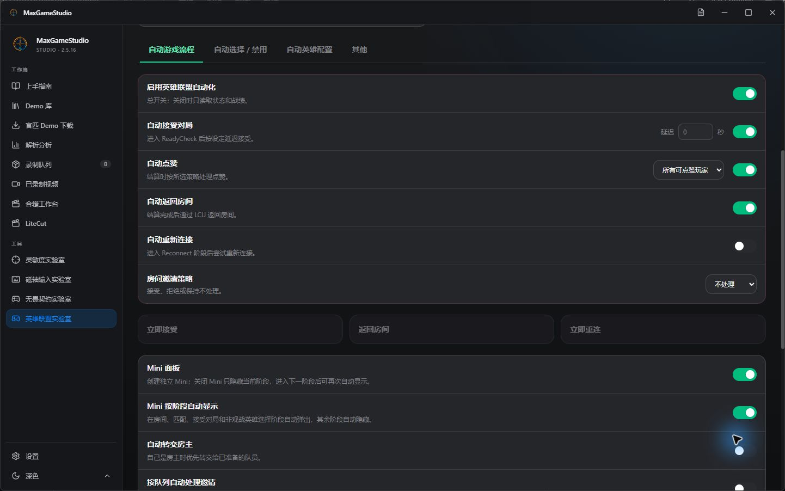
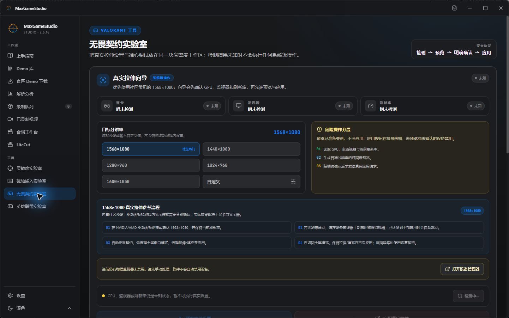

<h1 align="center">
   
  
   
  MaxGameStudio
   
</h1>

  <a href="./README.md"> 简体中文</a> |  English

<h3 align="center"><b>A local desktop workspace for personal training, match review, and multi-game tools</b> </h3>
<h4 align="center">CS2 · League of Legends · VALORANT · Peripheral Tuning</h4>

> **One MaxGameStudio desktop app:** CS2, League of Legends, VALORANT, and peripheral tuning share the same Tauri client. Open a game section to reveal all features for that game—no separate desktop applications are required.

> [!NOTE]
> **The current stable release is `v3.0.5`.** `v2.5.17` was withdrawn due to critical upgrade defects; users should upgrade directly to `v3.0.5`. The CS2 workspace, League features, and VALORANT features ship in one installer.

> This repository is not software written from scratch. It is a clearly attributed, noncommercial derivative built from source-available and open-source projects. Read the source and license boundaries below before using or redistributing it.

  <a href="./PLAYER_GUIDE_EN.md">User Guide</a> •
  <a href="./CONTRIBUTING_EN.md">Contributing</a> •
  <a href="#key-features">Key Features</a> •
  <a href="#installation">Installation</a> •
  <a href="#reference-project-and-attribution">Reference Project</a> •
  <a href="#disclaimer">Disclaimer</a> •
  <a href="#license">License</a>

## Reference Project and Attribution

- **Reference project:** See the [reference-project section in the Chinese README](./README.md#参考项目与致谢). It records the single reference-project entry requested for this product without presenting it as the source of MaxGameStudio's current desktop architecture or implementation.
- **Official Demo workflow reference:** [akiver/cs-demo-manager](https://github.com/akiver/cs-demo-manager). Its PostgreSQL data layer is not used, and the full project was not merged into this repository.
- **Steam Game Coordinator helper:** [akiver/boiler-writter](https://github.com/akiver/boiler-writter) 1.7.0 (GPL-3.0), downloaded only after first-use consent and executed unmodified as a separate process.
- **Share Code decoding:** a Python adaptation of [akiver/csgo-sharecode](https://github.com/akiver/csgo-sharecode) (MIT); its notice is retained at `third_party/licenses/csgo-sharecode-LICENSE.txt`.
- **League automation reference:** [LeagueAkari](https://github.com/LeagueAkari/LeagueAkari) (MIT) informed the local LCU and game-flow integration; this project implements its React/Tauri/FastAPI surface independently, retains the MIT notice at `third_party/licenses/LeagueAkari-LICENSE.txt`, and does not bundle the upstream Electron/Vue application.
- See [THIRD_PARTY_LICENSES.md](./THIRD_PARTY_LICENSES.md) for the complete dependency and license boundaries.

This repository does not display upstream donation QR codes or solicit money on behalf of upstream authors. The new orange crosshair/data-pulse emblem is an original project asset and does not use Valve's official CS2 mark.

---

## What's new in v3.0.5

> [!TIP]
> This release improves the multi-game home experience and update confirmation. See the [v3.0.5 Release](https://github.com/INEEDBUG/MaxGameStudio/releases/tag/v3.0.5) for the complete notes; the in-app updater uses a shorter, plain-language Fixes / New Features / Optimizations summary.

- **Explicit update confirmation** — The updater shows both “Update now” and “Skip this version”; downloading, installing, and restarting begin only after “Update now” is clicked.
- **Multi-game home** — The home route presents MaxGameStudio release notes instead of opening the CS2 guide as the default first screen.
- **Feedback links** — The home page provides Bug and Feature Issue forms, plus Pull Requests and repository links. Notes are bundled for offline startup.
- **Clearer navigation** — Home is a standalone sidebar entry, while the CS2 guide remains available inside the CS2 section.
- **VALORANT CFG sync** — True stretch patches existing resolution fields, creates a full backup, and locks `GameUserSettings.ini` by default, with unlock, restore, and drift detection; writes are refused while the game is running.

| Section | Directly accessible features |
| --- | --- |
| **CS2** | Demo library, official-match downloads, analysis, recording queue, video library, montage workbench, and LiteCut |
| **League of Legends** | Automation, Mini panel, match history, player center, ongoing-game analysis, and client toolkit |
| **VALORANT** | Safe true-stretch guide and crosshair/share-code tools |
| **Peripheral Tuning** | Sensitivity and magnetic-key input labs, no longer grouped under CS2 |

Highlights:

- **Regional language choices** — Traditional Chinese (Hong Kong), Traditional Chinese (Taiwan), Malay, and Russian are selectable. Malay and Russian are marked Beta because deeper screens can still fall back to English or Simplified Chinese.
- **Collapsible active sections** — Entering a game section still opens it automatically, while an explicit user collapse now remains respected.
- **No duplicate League navigation** — The five canonical League entries are no longer repeated inside the page body.
- **Dedicated ongoing-game page** — `/league/ongoing` now has its own page with settings, refresh, and standalone-window actions instead of reusing the large automation shell.
- **Progressive player loading** — The roster and player cards appear first; cards awaiting history show an explicit skeleton and update independently when richer data arrives.
- **Stricter premade inference** — Every player pair in a candidate group must meet the shared-match threshold, reducing chained false positives. Win-rate-team labels retain their sample evidence.
- **Bounded polling** — Partial snapshots refresh briefly at a faster interval, then return to the normal five-second cadence when ready. Unmounts and historical previews stop live requests.
- **Faster Mini auto-accept** — ReadyCheck events start the 0/0.1-second timer directly, duplicate events no longer reset the deadline, and transient event-stream failures reconnect and prime the current state.
- **Readable light theme** — Win rate, KDA, and Akari metrics retain sufficient contrast inside the dark ongoing-game player cards.

These behaviors are covered by targeted automated tests, but they are not promises of absolute latency on every PC. Release preparation did not execute League account actions and does not claim a complete live-client Lobby → ReadyCheck → ChampSelect → InProgress validation chain.

---

## Key Features

### Screenshots

These screenshots come from the `v2.5.16` desktop UI baseline and local demo fixtures; they are not presented as `v3.0.4`-specific screenshots. Disconnected and empty states are used where needed; the images contain no real SteamID, Riot ID, match history, or local installation path.

<table>
  <tr>
    <td width="50%" align="center"><b>League Lab: game-flow automation and Mini panel</b> </td>
    <td width="50%" align="center"><b>VALORANT Lab: true-stretch guide and crosshair tools</b> </td>
  </tr>
</table>

### Demo Library Management

- **Local Library Records** — List and thumbnail view showing match source, scoreboard, tracked players, display names, notes, and other key info.
- **Recent-Match Performance Board** — The default library view now follows a left-side recent-match rail plus selected-match detail layout. Existing analysis caches directly populate round results, both team scoreboards, K/D/A, ADR, KAST, Rating Pro 2.0/3.0, and the match hero/culprit. Grid and list views remain available.
- **Verified Match Time and Provenance** — Official share-code downloads persist Steam Game Coordinator `matchtime` separately from import time. SQLite sorting covers the complete paginated library. Older rows without server time explicitly show “match time unknown”; import time is only secondary context and is never relabeled as the match date. Cached official share codes can backfill older records.
- **Auto Directory Monitoring** — Supports monitoring demo download directories from 5E, Perfect World, Official Matchmaking, FACEIT, etc., with one-click import.
- **Local Steam Recent Matches** — Requires no personal Steam Web API key, game authentication code, or browser cookie. The app connects to the currently signed-in local Steam Game Coordinator and shows the latest eight official matches with verified match time, map, score, K/D/A, headshots, and MVPs. A demo is downloaded only when requested. Damage, ADR, KAST, and Rating are shown as unavailable until the demo is parsed locally.

### Highlight Parsing & Clip Discovery

- **Batch Demo Parsing** — Parse highlights from multiple demos simultaneously; highlights from the same player across different matches are organized by match.
- **Persistent Analysis History** — Completed analysis is stored in the local SQLite database. Recent results can be reopened from the analysis page without reparsing the Demo.
- **History While Parsing** — The history panel remains visible while background analysis runs, together with an elapsed timer. History cards stay read-only until the active job finishes so a running session cannot be replaced accidentally.
- **Scoreboard First** — Base analysis now opens on the full-match scoreboard with K/D/A, ADR, KAST, headshot rate, openings, AWP and utility damage, plus an S–D grade and improvement notes for every player.
- **Rating Pro 2.0 / 3.0** — Estimates kills, survival, adjusted KAST, damage and impact with separate T/CT baselines. RP3 adds per-round economy, multi-kills, trades/flash assists and Round Swing, following HLTV's public October 2025 direction of raising kill weight and reducing Swing. The UI exposes all six subratings, confidence, pure saves and the economy modifier before identifying the winning side's hero and losing side's culprit. These are explicitly not official HLTV values; see the [methodology](./docs/rating-pro-methodology.md).
- **Per-round Player Assessment** — The round explorer and completed 2D replay state grade every player from kills, deaths, openings, headshots and objective events.
- **Interactive 2D Replay** — Review round-by-round positions, paths, kills, smokes and fire areas. Click either side roster or a radar marker to select a player, with selection shared across the replay and assessment cards.
- **Single-team Tactical View** — Switch between global, Team A only and Team B only to filter opponent positions, paths, shots and utility. This is a review filter, not simulated geometric line-of-sight.
- **Target Player Lock** — Automatically identify all players in a match and locate targets by Steam ID, platform ID, or nickname; compatible with different demo export conventions from 5E, Perfect World, and Official Matchmaking.
- **Fine-grained Highlight Analysis** — Automatically categorizes **Highlights** (multi-kills, one-taps, clutches, knife kills, jump shots, defuses), **Fails** (taser, Deagle, team kills, "human magnet", "human tracing", "shoulder-to-shoulder" moments), **Cross-round Compilations** (favorite victim, nemesis, kill/death montage, continuous round recording), and **Meme Rounds** (211/o/i/z series with AI round commentary). See [Clip Types & Tags](./docs/highlight_tags.md) for tag descriptions.
- **Round Timeline** — Beyond auto-extracted clip cards, browse kill/death timelines by round to add specific shots, deaths, or entire rounds to the recording queue.
- **Continuous Round Recording** — Record from round start to death or round end; select multiple rounds to combine into a longer clip.

> **First-run performance:** base Demo analysis and 2D replay cache generation are separate stages. The first visit to a match's 2D replay also creates the whole-match Parquet cache, round binary trajectories, and smoke/fire effect cache, so it can take longer than reopening the same match. Cache hits read the local result directly. Upgrades do not delete existing replay caches from the application data directory.

> **Steam credential safety:** recent-match discovery uses only the active local Steam client session. It does not read a Steam password, browser cookies, or a personal Web API key. The optional isolated Game Coordinator helper requires explicit first-use consent and is version- and SHA-512-pinned.

### Product Video

- The product video is being remade. The previous cut is no longer distributed in the current Release.

### Training & Input Labs

- **Personal Sensitivity Diagnosis** — Opens a touch-to-hit target arena plus continuous tracking rounds, showing each candidate from the configured `sensitivity`, `m_yaw`, and DPI. Completion automatically reveals the too-fast/too-slow diagnosis, exact adjustment percentage, CS2-ready command, and retest range.
- **Local CS2 CFG Prefill** — Read-only discovery of local Steam CS2 settings can prefill sensitivity, resolution, and aspect ratio. DPI and GPU scaling still require user confirmation.
- **Magnetic-key Optimization** — Uses duplicate edges, hold jitter, A/D overlap, and direction-transition latency to recommend starting values for actuation, RT press, and RT release, followed by controlled `0.05–0.10 mm` retests.
- **Official Matchmaking Input Safety** — Regular Rapid Trigger can shorten key reset, while Snap Tap, Rapid Tap, Snappy Tappy, SOCD/LKP, and similar automated counter-direction features should be disabled for CS2 official matchmaking.

### VALORANT

- **Safe true-stretch guide** — Reads the local GPU, primary monitor, and refresh rate, then prepares detection and preview results for the community-popular `1568×1080` preset, other presets, or a custom resolution. Applying a real display mode requires explicit confirmation and offers keep/restore during a countdown; monitor state is detected, but monitors are never disabled automatically.
- **Crosshair editor and sharing** — Edits primary, ADS, and sniper crosshairs using VALORANT's P/A/S profile structure, with live preview, strict encode/decode, native-format code import/export, and local preset history. A backend fallback is never presented as an equivalent native share code.
- **Visible risk boundaries** — System-level actions follow a detect → preview → confirm → apply flow. Missing hardware or display evidence leaves the page read-only instead of claiming success.

### League of Legends

- **Automated game flow** — Uses local LCU/SGP integration for Riot and WeGame/Tencent clients to cover ready-check acceptance, matchmaking, play again, reconnect, honor, room invitation policies, and the phase-aware Mini panel.
- **Champion select and loadouts** — Configures champion pick/ban priorities, runes, summoner spells, and builds by mode and position, while exposing bench, swap, skin, and trade state. Local profiles replace the former dependency on a separate OP.GG window.
- **Match history and live analysis** — Provides cross-region Riot ID lookup, paginated SGP history, encounters, local labels, SQLite collection, combined filters, player center, ten-player ongoing-game analysis, premade inference, jungle-route profiles, a dedicated live window, and an optional summoner-spell timer.
- **Account and privacy boundaries** — The account-write master switch is prominent, high-risk manual actions require confirmation, and current LCU state is checked immediately before execution. LCU, Riot Client, and SGP credentials remain in memory and are never exported or uploaded.

### Auto Recording

- **Batch Recording Queue** — Queue multiple matches and clips; the program sequentially launches CS2 replay and drives OBS to produce videos; preview the entire plan before recording, with per-clip timing adjustments in the queue.
- **Pre-recording Spectator Settings** — One-click spectator HUD configuration (death notices only, hide IDs/chat/demo bars), FOV and viewmodel, flash brightness, voice, resolution and aspect ratio, OBS transitions between clips; experimental POV first-person HUD can be enabled per-match.
- **Diverse Output Styles**:
  - Observer view or POV first-person HUD (toggle radar, adjust top player count display)
  - Clean spectator view, custom FOV, hide grenade trajectories
  - **Victim POV** — After highlight or multi-kill compilations, automatically append victim perspective clips
  - **Keyboard Overlay** — Display WASD, crouch/jump keys in OBS, with manual sync adjustment if needed
  - Fade in/out transitions between clips
- **Safe Recording Solution**:
  - Controls recording via OBS and game state coordination, no injection or game hooking
  - Automatically backs up and restores your keybinds and graphics settings after recording

### Compilation Workbench

- Successfully recorded clips are automatically stored in the library; use the Compilation Workbench to drag-and-drop reorder, add BGM/transition themes, and export MP4; filter by highlight/fail/compilation/timeline types, with intro/outro arrangement.
- **Player Info Card** — Enable bottom-left corner watermark when exporting: briefly displays player nickname, clip type (highlight/fail/compilation), round and scenario tags (e.g., multi-kill, one-tap) at the start of each clip; upload custom avatars for each player appearing in the timeline, or display first letter of nickname if no avatar. Perfect for polished highlight intros without manual PR editing.
- **FFmpeg Configuration Required**: Download Windows builds from [FFmpeg Official](https://ffmpeg.org/download.html) or [gyan.dev](https://www.gyan.dev/ffmpeg/builds/), extract and set the full path to `ffmpeg.exe` in the settings page. Export prioritizes GPU hardware encoding (NVENC/QSV/AMF), falling back to software encoding if unavailable.

### AI Commentary (Optional)

- **OpenAI-Compatible Multi-Provider** — Built-in support for DeepSeek, Tongyi Qwen, Zhipu GLM, MiniMax, OpenAI, OpenRouter; local models via Ollama, LM Studio.
- **Sarcastic Persona Prompt** — Hype for highlights, roast for fails, meme deaths as jokes; hard constraint under 100 characters, single-line JSON output, no off-topic chatter.
- **Round Meme Compilation Review** — 211/o/i/z meme rounds trigger "Round Comprehensive Review", independent from clip-level scoring.

---

## Installation

Download the latest `MaxGameStudio_x.x.x_x64-setup.exe` from this repository's [Releases page](https://github.com/INEEDBUG/MaxGameStudio/releases), run the installer and follow the prompts.

By default, the window `×` button asks whether to keep the app running in the Windows system tray or exit completely, with an option to remember the choice. Parsing and downloads continue while the app is in the tray. The behavior can be changed at any time under Settings → System & Updates.

After installation, launch from desktop or start menu. **No browser or manual backend start is required.** The lightweight Tauri shell starts the bundled Python backend and renders the UI with the Windows system WebView2 runtime.

The desktop app checks the signed GitHub updater channel at launch and every 15 minutes while running or resident in the tray. Stable releases show a plain-language Fixes / New Features / Optimizations summary first; downloading, verifying, installing in place, and relaunching begin only after the user clicks “Update now”. “Skip this version” suppresses that release during automatic checks, while a manual check can show it again. User settings, demo data and projects remain in the separate application-data directory. The formal publication channel accepts only strict `x.y.z` stable versions: GitHub Releases, `updater/latest.json`, and the `updater` branch never receive versions with any prerelease suffix such as `-rc`, `-beta`, or `-alpha`. Test builds are available only as GitHub prereleases for manual download; `workflow_dispatch` uploads a private Actions artifact and does not create a public Release. Older online installers may still use `CS2.Ultimate.Insight.Studio_<version>_x64-setup.exe`; the client recognizes that exact legacy name while preferring the current `MaxGameStudio_<version>_x64-setup.exe` asset. Manual installers remain available on [this project's Releases page](https://github.com/INEEDBUG/MaxGameStudio/releases).

> **Recommended: Installation path without Chinese characters.** e.g., `D:\MaxGameStudio\` ✅, `D:\游戏工具\MaxGameStudio\` ❌

---

## Version History and Next Steps

| Stage | Delivered | Status |
| --- | --- | --- |
| **V1 · Parsing and direction** | Highlight parsing, AI commentary, and automatic directing | ✅ Complete |
| **V2 · Desktop workflow** | Lightweight Tauri desktop, FFmpeg compilation workbench, experimental POV HUD, round timeline and recording queue, spectator warm-up, victim POV, and virtual-keyboard OBS overlay | ✅ Complete |
| **V3 · Deep review** | Demo analysis and history, player/round assessments, 2D player selection, single-team tactical view, utility damage and per-round utility metrics, grenade trajectories, movement paths, and heatmap-based route review | ✅ Complete |
| **v2.5.16 · Multi-game labs** | League Lab and VALORANT Lab merged into the stable MaxGameStudio installer with legacy in-place updater compatibility | ✅ Released |
| **v2.5.17 · Withdrawn** | Critical upgrade-installation and automatic-update boundary defects | ⛔ Withdrawn |
| **v3.0.1 · Upgrade fixes** | Fixes safe cleanup, version skipping/forced updates, and Release title version parsing | ✅ Released |
| **v3.0.2 · Performance and training** | Reduces large-Demo parsing time and memory, adds plain-language updater summaries, and uses real clicks to classify underflicks, overflicks, and off-axis misses | ✅ Released |
| **v3.0.3 · Game sections and League stability** | Reorganizes navigation by game; gives automation, match history, player center, ongoing-game analysis, and toolkit direct League entries; merges duplicate status requests and fixes Mini/navigation/async races | ✅ Released |
| **v3.0.4 · Regional languages and live-game analysis** | Adds four regional language choices, fixes active-section collapse, removes duplicate League navigation, and gives ongoing-game analysis a dedicated progressively loaded page with stricter premade and win-rate evidence | ✅ Released |
| **v3.0.5 · Home, update confirmation, and VALORANT CFG** | Adds a standalone home and feedback links; requires explicit update confirmation; adds CFG resolution sync, backup, read-only lock, unlock, and restore to true stretch | ✅ Current stable |

### Planned

- [ ] **Advanced tactical coach** — Add route comparison, utility-quality scoring, and explainable automated tactical suggestions on top of the existing metrics, trajectories, and route review.
- [ ] **Review presentation** — Add clearer per-match comparisons, filtering, and exportable reports for the existing tactical indicators.
- [ ] **Release trust** — Add publicly verifiable Authenticode signing for the Windows installer. Tauri updater signatures and Windows installer trust are separate verification chains.

---

## Ownership

- **INEEDBUG** — product owner; responsible for requirements, key decisions, acceptance, and releases.
- **Codex** — development collaboration, implementation, and delivery auditing.

See [`AUTHORS.md`](AUTHORS.md) for detailed project attribution.

---

## License

This project is released under the [PolyForm Noncommercial 1.0.0](https://polyformproject.org/licenses/noncommercial/1.0.0/) license.

- Personal learning, research, hobby, review, and other non-commercial uses are permitted. Under this license, you may read, modify, build, and distribute this project's source code and derivatives.
- Without written authorization, commercial use is prohibited, including but not limited to: commercial software, paid services, commercial editing/recording services, commercial platform integration, sales, rental, resale, or distribution as part of commercial products.
- 📦 If you distribute compiled products, installers, or modified versions of this project, please retain this project's license statement and comply with all third-party open source component licenses listed in `THIRD_PARTY_LICENSES.md`.

## Disclaimer

Counter-Strike 2, CS2, Counter-Strike, Steam, Valve and related names, trademarks, and logos belong to their respective owners.

This project is not affiliated with, partnered with, sponsored by, authorized by, or endorsed by Valve Corporation, Perfect World Arena, 5E Arena, OBS Studio, or other related platforms or software owners.

### Safe Usage Tips

- **Default Recording Process** launches CS2 with `-insecure` for local demo playback only; no DLL injection or hooking; does not modify `.dem` files on disk, does not connect to, modify, or interfere with any official game servers, matchmaking services, or anti-cheat systems, nor does it provide any cheating, detection bypass, or fair-play disruption features. **Do not use in parallel with a CS2 client logged into matchmaking servers** to avoid triggering unnecessary anti-cheat warnings.
- If you **actively enable POV** in "Common Parameters → Experimental Features", the program temporarily writes `pov.vpk` to CS2's `game/csgo` directory and **incrementally modifies** `gameinfo.gi`'s `SearchPaths` to load POV HUD resources; automatically restored after recording or abnormal termination. This mode also **forces** `-insecure` when launching CS2. **Do not use to connect to VAC-secured servers**.
- Recording temporarily modifies several CS2 archive cvars and keybinds. This project automatically backs up your original `config.cfg` / `video.txt` / `user_convars_*.vcfg` to the program data directory's `.cs2_config_backup` when starting recording, and restores them afterward; if settings were overwritten due to abnormal exit, manually retrieve original files from that directory.
